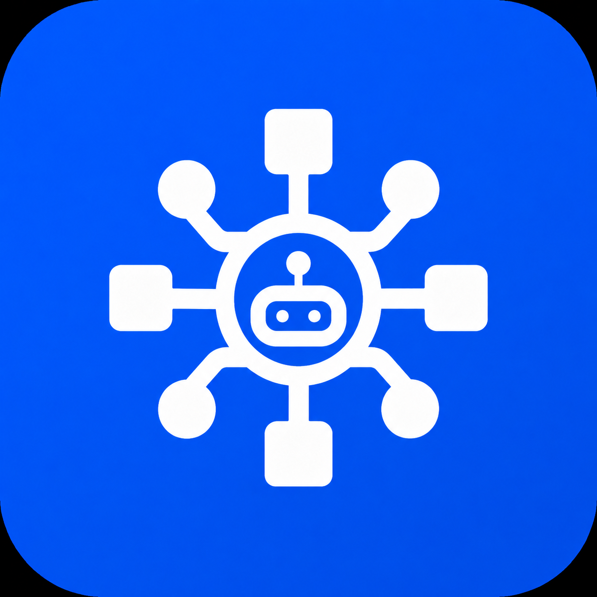

<p align="center">
  
</p>

<h1 align="center">Skills</h1>

<p align="center">
  A centralized, versioned library of reusable <a href="https://claude.ai/claude-code">Claude Code</a> skills for the Asymmetric Effort organization.
</p>

<p align="center">
  <a href="https://skills.asymmetric-effort.com">Documentation</a> ·
  <a href="https://github.com/asymmetric-effort/skills/issues">Issues</a>
</p>

## What Are Skills?

Skills are structured Markdown files that teach Claude Code how to perform specific tasks. Each skill contains a prompt with detailed instructions, guidelines, and examples that Claude follows when the skill is invoked. Think of them as reusable playbooks — instead of re-explaining a workflow every session, you invoke a skill and Claude executes it consistently.

## Why a Shared Repository?

Without a shared skills repo, every project reinvents the same prompts: "how to commit," "how to review a PR," "how to run a security audit." This repo solves that by:

- **Centralizing** skills so they're written once and used everywhere
- **Versioning** skills with semver tags so projects can pin to stable versions
- **Standardizing** the format so skills are predictable and composable
- **Growing** the library over time as new workflows are identified

## Architecture: Two Branches

This repo uses a two-branch publishing model:

| Branch | Purpose | Contents |
|--------|---------|----------|
| `main` | **Authoring** — where skills are written and organized | Nested tree: `<class>/<subclass>/<skill>/SKILL.md` |
| `release` | **Consumption** — what projects install as a submodule | Flat files: `<skill-name>.md` + `skills.json` index |

A CI pipeline (`publish-skills` job) automatically flattens the source tree and publishes to the `release` branch on every push to `main`. Consumer projects should always reference the `release` branch.

## Quick Start

### Adding Skills to Your Project

Add the `release` branch as a git submodule:

```bash
git submodule add -b release git@github.com:asymmetric-effort/skills.git .claude/skills
git commit -m "chore: add shared skills submodule"
```

This gives you a flat directory of skill files that Claude Code can discover:

```
.claude/skills/
  audit-deps.md
  commit.md
  pentest.md
  push-changes.md
  review-pr.md
  ...
  skills.json       # Index of all skills with metadata
  VERSION            # Current version
```

### Upgrading Skills

```bash
cd .claude/skills
git fetch origin
git pull origin release
cd ../..
git add .claude/skills
git commit -m "chore: bump skills to latest"
```

Or use the `/upgrade-skills` skill to automate this.

### Using a Skill

Once the submodule is in place, invoke skills in your Claude Code session:

```
/commit
/review-pr 42
/pentest
/push-changes
```

Claude reads the corresponding `.md` file from `.claude/skills/` and follows the instructions within it.

## Source Structure (main branch)

```
skills/
├── CLAUDE.md               # Project instructions for Claude
├── README.md               # This file
├── SKILL_TEMPLATE.md       # Template for creating new skills
├── logo.png                # Project logo
│
├── automation/             # Workflow automation, scripting, scheduled tasks
│   ├── integrations/
│   │   └── monitor-upstream/
│   ├── scheduling/
│   │   ├── loop/
│   │   └── schedule/
│   └── workflows/
│       ├── monitor-issues/
│       └── resolve-issues/
│
├── data/                   # Data processing, analysis, transformation
│   └── processing/
│       └── pdf/
│
├── development/            # Coding, debugging, refactoring, architecture
│   ├── commit/
│   ├── debugging/
│   │   └── file-bug/
│   ├── gap-analysis/
│   ├── project-plan/
│   └── review-pr/
│
├── devops/                 # CI/CD, containers, infrastructure, deployment
│   ├── ci-cd/
│   │   └── ci-status/
│   └── deployment/
│       ├── blue-green-deploy/
│       ├── push-changes/
│       └── upgrade-skills/
│
├── documentation/          # Writing docs, READMEs, changelogs, ADRs
│
├── jokes/                  # Fun, humor, easter eggs
│   ├── code-humor/
│   ├── easter-eggs/
│   ├── epitaphs/
│   ├── one-liners/
│   ├── puns/
│   └── storytelling/
│
├── security/               # Auditing, hardening, vulnerability analysis
│   ├── auditing/
│   │   └── audit-deps/
│   └── pentest/
│
├── testing/                # Test creation, coverage, fuzzing, benchmarks
│   ├── e2e/
│   │   └── pdv/
│   └── test-strategy/
│       └── check-coverage/
│
└── site/                   # Documentation website (skills.asymmetric-effort.com)
    ├── src/                # Vite SPA source code
    ├── e2e/                # Pre-deployment Playwright tests
    ├── e2e-pdv/            # Post-deployment verification tests
    └── scripts/            # Build scripts (data generation, skill flattening)
```

## Skill Catalog

### Automation

| Skill | Description |
|-------|-------------|
| `loop` | Recurring prompt execution with fixed-interval and dynamic modes |
| `monitor-issues` | Triage GitHub issues filtered by trusted sources |
| `monitor-upstream` | Track dependency releases and verify upstream fixes |
| `resolve-issues` | Automated issue resolution with TDD, worktrees, and PRs |
| `schedule` | Cloud remote agent trigger CRUD via RemoteTrigger API |
| `scheduling` | Set up scheduled and recurring tasks using cron and timers |

### Data

| Skill | Description |
|-------|-------------|
| `pdf` | PDF reading, analysis, and content extraction |

### Development

| Skill | Description |
|-------|-------------|
| `commit` | Git commit workflow with conventional messages |
| `file-bug` | Structured upstream bug reports with duplicate detection |
| `gap-analysis` | Compare two projects for feature compatibility gaps |
| `project-plan` | Consume markdown plan files and generate GitHub issues |
| `review-pr` | Pull request code review with structured feedback |

### DevOps

| Skill | Description |
|-------|-------------|
| `blue-green-deploy` | Staged deployment with PDV gates, promotion, and rollback |
| `ci-status` | CI/CD pipeline health check with failure classification |
| `push-changes` | Full commit-bump-tag-push cycle with CI monitoring |
| `upgrade-skills` | Bump the skills submodule to a newer version |

### Jokes

| Skill | Description |
|-------|-------------|
| `code-humor` | Programming jokes and tech comedy |
| `easter-eggs` | Hidden features and surprise interactions |
| `epitaphs` | Witty, darkly humorous tombstone inscriptions |
| `one-liners` | Quick, punchy single-line jokes |
| `puns` | Wordplay, double meanings, groan-worthy puns |
| `storytelling` | Humorous narratives and shaggy dog stories |

### Security

| Skill | Description |
|-------|-------------|
| `audit-deps` | Deep supply chain and dependency audit |
| `pentest` | White-box penetration test code review |

### Testing

| Skill | Description |
|-------|-------------|
| `check-coverage` | Test coverage analysis with gap identification |
| `pdv` | Playwright post-deployment verification |

## Skill File Format

Every skill is a Markdown file with YAML frontmatter and three required sections:

```markdown
---
name: skill-name
description: One-line description of what this skill does
category: class-name
tags: [relevant, tags]
---

# Skill Name

## Purpose

What this skill accomplishes and when to use it.

## Prompt

Detailed instructions Claude follows when this skill is invoked.

## Examples

Sample invocations, inputs, outputs, or generated artifacts.
```

### Published Format (release branch)

When published to the `release` branch, each skill is flattened to `<name>.md` with additional frontmatter fields injected:

```yaml
source_path: security/auditing/audit-deps   # Original location in source tree
class: security                              # Top-level class
subclass: auditing                           # Subclass within the class
```

A `skills.json` index is also published with metadata for all skills.

## Contributing

### Adding a New Skill

1. **Pick the right location.** Find the class and subclass that best fits. If none fits, create a new one.

2. **Create the skill directory and files:**
   ```bash
   mkdir -p <class>/<subclass>/<skill-name>
   cp SKILL_TEMPLATE.md <class>/<subclass>/<skill-name>/SKILL.md
   echo "# <skill-name>" > <class>/<subclass>/<skill-name>/README.md
   ```

3. **Write the skill.** Fill in all sections of `SKILL.md` with substantive content.

4. **Update parent READMEs.** Add entries to the subclass and class `README.md` tables in alphabetical order.

5. **Test the skill.** Invoke it in a real project to verify it works.

6. **Commit, tag, and push:**
   ```bash
   git add .
   git commit -m "feat: add <skill-name> skill for <purpose>"
   git tag -a v0.0.N -m "v0.0.N"
   git push origin main --tags
   ```

CI will automatically flatten and publish the skill to the `release` branch.

### Requesting a Skill

[Open an issue](https://github.com/asymmetric-effort/skills/issues/new) with the title format:

```
Create reusable skill: <name> (<short description>)
```

Issues from authorized users are automatically resolved by Claude.

## CI/CD Pipeline

Every push to `main` triggers:

1. **build-site** — Generate skill data, build the documentation site, run 12 pre-deployment Playwright tests
2. **deploy** — Publish the documentation site to GitHub Pages at [skills.asymmetric-effort.com](https://skills.asymmetric-effort.com)
3. **publish-skills** — Flatten the skill tree and force-push to the `release` branch with version tags
4. **pdv** — Run 17 post-deployment verification tests against the live site

Additional CI:
- **CodeQL** — Weekly security scanning
- **Dependabot** — Automated dependency updates for npm packages and GitHub Actions

## Versioning

This repo uses semantic versioning with patch-only bumps:

- **v0.0.N** — each new skill or skill update increments the patch version
- Tags are annotated: `git tag -a v0.0.N -m "v0.0.N"`
- Consumer projects get updates by pulling the `release` branch
- Breaking changes (skill renames, deletions) will bump minor version with a deprecation notice

## License

Copyright Asymmetric Effort, LLC. All rights reserved.
